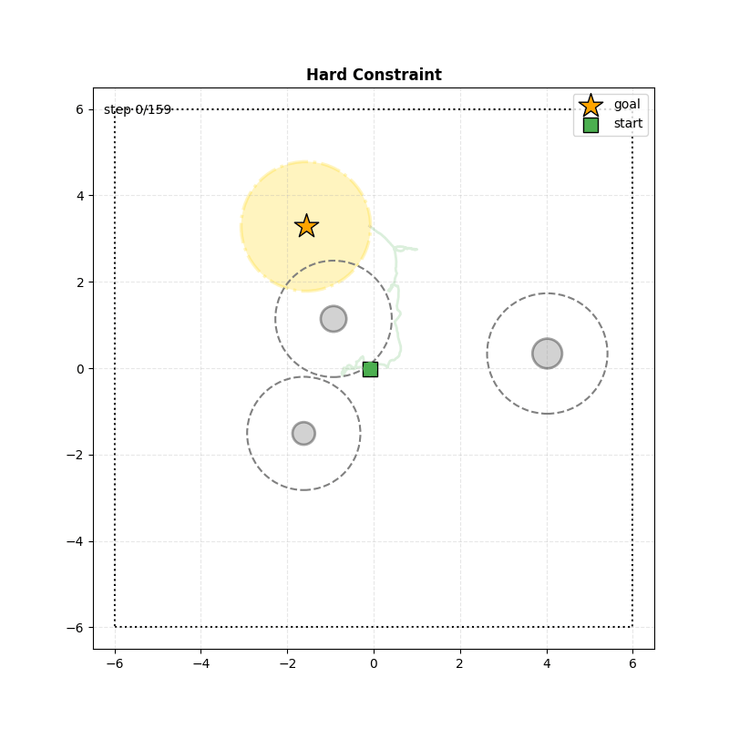
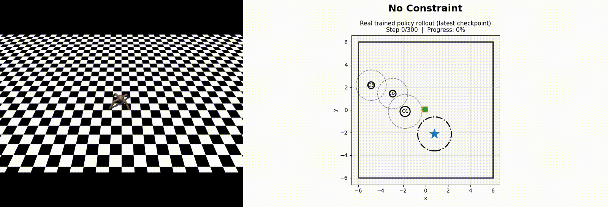
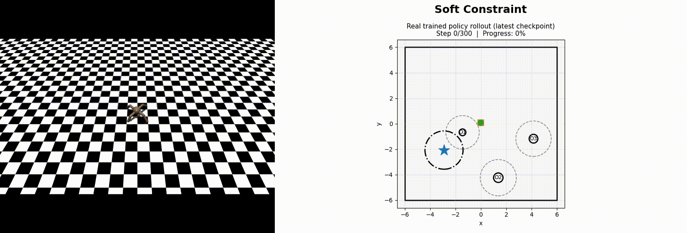
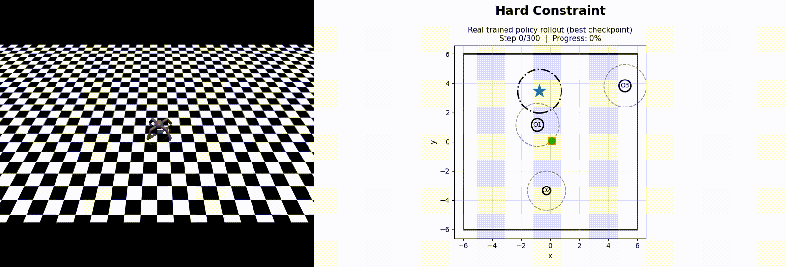
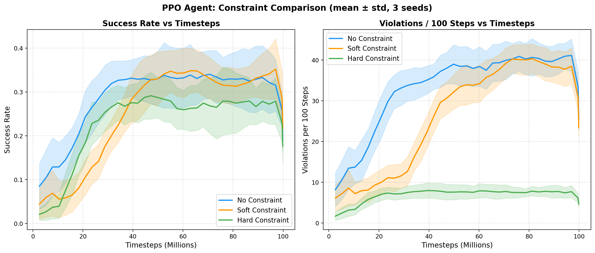

# 🐜 Safe Reinforcement Learning for Robot Navigation (Brax Ant)

This project investigates **safe reinforcement learning strategies for robotic navigation** using the **Brax Ant environment**.  
The objective is to compare different constraint strategies for safe navigation in environments containing obstacles.

The project evaluates three reinforcement learning variants:

- **No Constraint** → standard reinforcement learning without safety penalties  
- **Soft Constraint** → safety violations are penalized but do not terminate the episode  
- **Hard Constraint** → safety violations immediately terminate the episode  

The goal is to analyze how these strategies affect:

- success rate
- safety violations
- collision rate
- learning efficiency

The experiments are designed to run on **Compute Canada HPC clusters** using **Slurm** and **Apptainer containers**.

---

# Demo

Example rollout of a trained agent (2D):



This visualization shows:

- the robot trajectory
- the start position
- the goal region
- obstacles and safety buffers
- the final robot position

---

# Research Questions

This project investigates the following questions:

1. Does Proximal Policy Optimization (PPO) inherently learn safe navigation behaviors?
2. How do different constraint mechanisms affect safety violations during training?
3. What trade-off exists between task performance and safety enforcement?

We hypothesize that:

- PPO without constraints will learn policies that maximize reward but ignore safety.
- Soft penalties will partially reduce unsafe behavior.
- Hard constraints will enforce safety more effectively but may reduce task performance.

---

# Project Structure

```txt
Safe_RL_Brax_Ant
│
├── docs                         # Project report and documentation
│   └── Honours_Report.pdf
│
├── envs                         # Reinforcement learning environments
│   ├── baseline_env.py
│   ├── hard_constraint_env.py
│   ├── no_constraint_env.py
│   └── soft_constraint_env.py
│
├── scripts                      # Training and aggregation scripts
│   ├── train_pipeline.py
│   ├── train_model.py
│   └── aggregate_models.py
│
├── slurm                        # Slurm batch scripts for Compute Canada
│   ├── hard_constraint_pipeline.sh
│   ├── soft_constraint_pipeline.sh
│   └── no_constraint_pipeline.sh
│
├── gifs                         # Rollout visualizations (GIF format)
│
├── demo                         # Demonstration videos
│
├── policies                     # Saved trained models
│
├── results                      # Training metrics and learning curves
│
├── README.md                    # Project documentation
└── requirements.txt             # Python dependencies
```

---

# Environment Description

The navigation environment is built on top of **Brax Ant**.

The robot must navigate in a **2D arena with obstacles**.

Key characteristics:

- arena size: 6 × 6
- goal radius: 1.5
- multiple randomly generated obstacles
- randomized start and goal positions
- safety buffer zones around obstacles

The observation vector includes:

```txt
ant_obs,                    # Standard Brax Ant observation (joint angles, joint velocities, body orientation, and internal robot state)

torso_position_history,     # Recent history of the robot torso position in the plane (x,y) at times t-2, t-1, and t, used to capture motion direction

torso_velocity,             # Current velocity of the robot torso in the plane (vx, vy)

goal_direction,             # Vector pointing from the robot position to the goal (goal_position - robot_position)

relative_obstacle_positions,# Positions of obstacles relative to the robot (obstacle_position - robot_position)

obstacle_radii              # Radius of each obstacle, used for collision detection and safety buffer computation
```

---

# Reinforcement Learning Algorithm

The training uses a **Pure JAX PPO implementation**.

Features:

- vectorized environments
- generalized advantage estimation (GAE)
- clipped PPO objective
- actor-critic neural network

Training parameters:
```txt
PPO epochs: 8            # Number of optimization passes over the collected rollout data during each PPO update

Minibatch size: 4096     # Number of samples used in each gradient update during PPO training

Hidden layer size: 256   # Number of neurons in each hidden layer of the actor–critic neural network

Learning rate: 3e-4      # Step size used by the optimizer to update the neural network weights

Gamma: 0.99              # Discount factor controlling how much future rewards are considered during training

GAE lambda: 0.95         # Parameter for Generalized Advantage Estimation controlling the bias–variance tradeoff in advantage computation

num_envs = 1024      # Number of environments simulated in parallel to collect experience faster during training

max_steps = 500      # Maximum number of steps allowed per episode before the episode is terminated
```

---

# Safety Constraints

## No Constraint

- reward only depends on progress toward the goal
- safety violations are not penalized
- episode ends only on success or time limit

Example (3D):



Observation:
```txt
The ant 🐜 behaves very erratically and prioritizes reaching the goal over safety. 
```

## Soft Constraint

Safety violations add penalties:

- collision penalty
- out-of-bounds penalty
- speed violation penalty
- fall penalty

But the episode **continues**.

Example (3D):



Observation:
```txt
 The agent attempts to avoid obstacles but often chooses aggressive or unsafe trajectories to reach the goal.This suggests that penalties alone may not be sufficient to enforce safe navigation. 
```

## Hard Constraint

Safety violations immediately terminate the episode:

- collision
- out of bounds
- fall

Speed violations receive a strong penalty.

Example (3D):



This visualization shows:
```txt
 The agent strongly avoids obstacles and respects safety buffers.However, strict constraints sometimes prevent the agent from reaching the goal, highlighting the trade-off between safety and task completion. 
```

---

# Key Results

The experiments compare the three constraint strategies over 100M training timesteps.

Main observations:

- **No Constraint** reaches the goal but produces many unsafe behaviors.
- **Soft Constraint** achieves the highest success rate but still produces many safety violations.
- **Hard Constraint** strongly reduces safety violations, but with a lower success rate.

Final evaluation summary:

| Model | Success Rate | Violations / 100 Steps | Avg Collisions / Episode | Avg Episode Reward |
|------|--------------|------------------------|---------------------------|--------------------|
| No Constraint | 0.299 | 42.39 | 10.80 | 22.23 |
| Soft Constraint | 0.342 | 38.76 | 12.00 | -535.87 |
| Hard Constraint | 0.270 | 7.04 | 10.30 | -22.86 |

These results show a clear **safety–performance trade-off**.  
Soft constraints improve task success but do not fully prevent unsafe behavior, while hard constraints enforce safety more strongly at the cost of reduced task performance.




---

# Installation

Python version used:
```txt
Python 3.10
```

Install dependencies:
```bash
pip install -r requirements.txt
```

---

# Running on Compute Canada (Slurm)

This project is designed for **Compute Canada clusters** using:

- Slurm job scheduling
- Apptainer containers
- GPU compute nodes

---

# Required Changes Before Running

Before launching the jobs, modify the following fields inside the Slurm scripts.

### Replace account
```txt
#SBATCH --account=user_account
```
with your Compute Canada allocation:
```txt
#SBATCH --account=def-youraccount
```
Example:
```txt
#SBATCH --account=def-l-ab
```

---

### Replace email
```txt
#SBATCH --mail-user=user_mail
```
with your email:
```txt
#SBATCH --mail-user=your_email@domain.com  
```

You will receive a notification once training completes.

---

### Update project directory

Inside the script:
```txt
PROJECT_DIR="/scratch/username/ppo_agent"
```

replace with your project path:
```txt
PROJECT_DIR="/home/username/project_directory"
```

---

### Container location

Make sure the container exists:
```txt
CONTAINER="${PROJECT_DIR}/python_3.10.sif"
```

---

# Running Training

Before launching the training pipelines, create a **new project directory** on the cluster and make sure it follows the structure below.

This step is important because the Slurm scripts expect all main training files, environment files, batch files, and the empty `Results/` directory to be located in the same project directory before execution.

```txt
project_root
│
├── train_pipeline.py
├── train_model.py
├── aggregate_models.py
│
├── baseline_env.py
├── no_constraint_env.py
├── soft_constraint_env.py
├── hard_constraint_env.py
│
├── s_batch_no_constraint.sh
├── s_batch_soft_constraint.sh
├── s_batch_hard_constraint.sh
│
├── requirements.txt
│
└── Results/
```
The Results/ directory must be created before running the jobs and should initially be empty. It will automatically store checkpoints, evaluation files, learning curves, rollout data, and aggregated results during training.

---

# Launching Training Jobs

Training is executed through Slurm batch scripts.

Submit the jobs using:
```bash
sbatch s_batch_no_constraint.sh
sbatch s_batch_soft_constraint.sh
sbatch s_batch_hard_constraint.sh
```
These scripts will automatically:
```txt
1. Launch multiple training jobs using different random seeds
2. Train the PPO agent
3. Save checkpoints and evaluation metrics
4. Aggregate results after all seeds complete
```

---

# Training Output Structure
After training begins, the Results directory is automatically populated.

Example structure:
```txt
Results/
└── t100m
    │
    ├── no_constraint
    │   ├── seed_0
    │   ├── seed_1
    │   ├── seed_2
    │   ├── seed_3
    │   ├── seed_4
    │   └── aggregated
    │
    ├── soft_constraint
    │   ├── seed_0
    │   ├── seed_1
    │   ├── seed_2
    │   ├── seed_3
    │   ├── seed_4
    │   └── aggregated
    │
    └── hard_constraint
        ├── seed_0
        ├── seed_1
        ├── seed_2
        ├── seed_3
        ├── seed_4
        └── aggregated
```
Each seed directory contains:
```txt
seed_X/
│
├── checkpoints/
├── model/
├── curves/
├── eval/
└── rollouts/
```
These folders store:
```txt
1. trained policy checkpoints
2. evaluation metrics
3. learning curves
4. rollout visualizations
```
# Aggregated Results
After all seeds finish training, the pipeline aggregates the results.

The aggregated statistics are stored in:
```txt
Results/<budget>/<model>/aggregated/
```
Example:
```txt
Results/t100m/hard_constraint/aggregated/
```
The file:
```txt
final_table.csv
```
contains the averaged metrics across all seeds.

Evaluation metrics:
```txt
1. success_rate                 # Fraction of episodes in which the robot reaches the goal

2. violations_per_100_steps     # Number of safety violations normalized per 100 steps

3. avg_time_to_failure          # Average steps before failure occurs

4. mean_episode_length          # Average episode duration

5. avg_collisions_per_episode   # Average number of collisions per episode

6. avg_episode_reward           # Average cumulative reward per episode

```

These metrics summarize the performance and safety behavior of each training strategy.


---

# License
This project is provided for academic and research purposes.

---

# Report

The full research report describing the methodology, experiments, and analysis is available in:
```txt
docs/Honours_Report.pdf
```